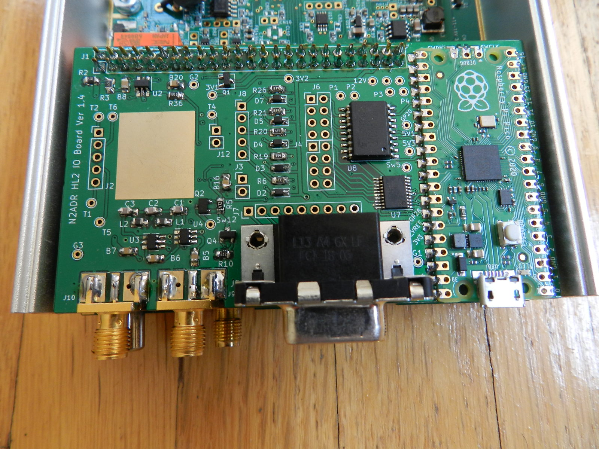
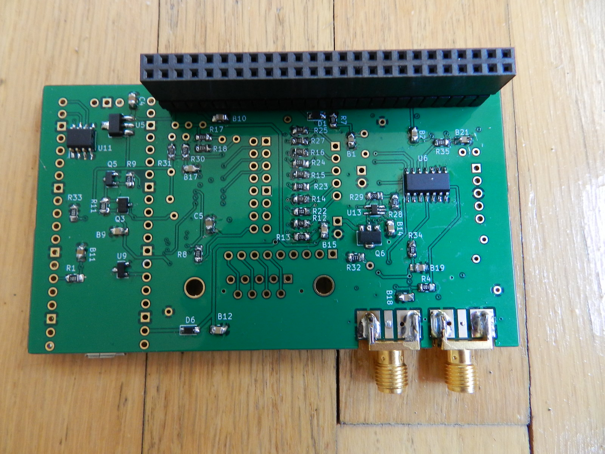
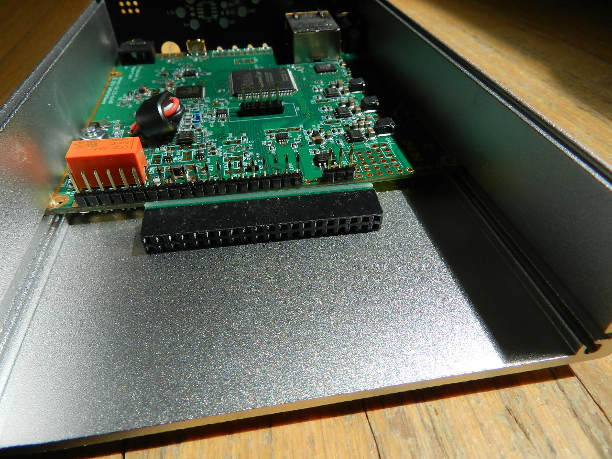

# IO Board for the Hermes Lite 2 by N2ADR
**May 13, 2023**

**Please click the left button "-  ----" above for a navigation menu.**

**This documentation is preliminary, and may change based on input from the HL2 community. Further documentation is coming, stay tuned. Please provide feedback, especially if you see a problem.**

This project is a 5 by 10 cm printed circuit board and related firmware. The board mounts above the N2ADR filter board in the same box as the Hermes Lite 2. The PC running the SDR software sends the transmit frequency to the board. The microcontroller on the board then uses the board's switches to control an amplifier, switch antenns or transverters, etc. There are a variety of IO resources available and there will be different microcontroller software for each application. The IO board is meant to be a general purpose solution to control hardware attached to the HL2.

The board has a Pico microcontroller and IO resources including
5 volt gates, low side switches, a fan controller, and a UART. There are two SMA connectors for a separate Rx input and a Pure Signal input.
The board plugs into the [Hermes Lite 2](http://www.hermeslite.com) main board and replaces the 2x20 jumper that connects to the N2ADR filter board.
The board sits directly above the filter board as shown in the photos below.

To use the board it will be necessary to choose which switches you need and solder wire jumpers from the switches to the DB9 connector. Then you must write or download firmware for the Pico that will operate the switches based on the transmit frequency.

#### IO board mounted above the filter board

#### Top view of the board

#### Bottom view of the board

## Modification to the HL2 Main Board
The HL2 main board must be modified by adding three extra header pins. In the picture below, look at the normal 20 pin
header at the back edge of the board. Following that, two holes are skipped, and then a 1x3 header is added. This changes the
20 pin header to a 25 pin header with two unused pins. The extra pins provide 3.3 volts, ground and VSUP.
VSUP is the 12 volt HL2 input supply taken after the fuse.
It is convenient to place the 2x20 pin header across the existing pins and the three added pins to provide
alignment when soldering. The IO board has a 2x25 pin header. When installed, this connects the HL2 to the filter board as usual.

## Initial Testing of the IO Board
First program the Pico with the test program.
Power off the HL2 and connect a USB cable to the IO Board.
Push the button on the Pico and then plug the USB cable into your PC.
The Pico will appear as a flash drive on the PC. Then copy the file n2adr_test/build/main.uf2 to the Pico. The Pico will reboot and the Pico LED will flash slowly.

Now apply power to the HL2 and the IO board. Use an oscilloscope to see the test signals.
  * Look for pulses of 1,2,3,4,5,6,7 milliseconds on J4 pins 1 to 7.
  * Look for 3.0 volts DC on J4 pin 8.
  * Look for 0.5 * supply voltage at J3 pin 1.
  * Look for a 5.0 volt 500 Hz square wave at Sw5.
  * Look for a supply voltage 250 Hz square wave at Sw12.

## Design of the IO Board Hardware
The IO board is a four-layer PCB. Rather large parts are used, with none smaller than 0805 (2012 metric). It is designed to be easy to solder at home. It is only necessary to mount the parts you plan to use.

Please refer to the [schematic](KiCad/HL2IOBoard.pdf).
The IO board has two I2C addresses. Address 0x41 register 0 is a read only register that returns the hardware version number
in bits 3 to 0, and 0xF in bits 7 to 4. So for this hardware version, it returns 0xF1. If other IO boards become available,
they will return different version numbers. This is the hardware version and will be returned even if the firmware is not running.
Reading this register can test whether the filter board is installed.

The Pico microcontroller listens to I2C address 0x1D. This is distinct from the filter board I2C address, and the IO board will
not conflict with or control the filter board. The IO board has these resources controlled by the Pico:

 * Eight 5 volt CMOS outputs and eight low-side switches (mosfets to ground). Both are controlled by the same Pico pin,
so they can be used in any combination, but only up to eight total. They are high speed except for output 8. This has an RC filter and is intended for
optional zero to five volt PWM DC output. The DC output can be programmed to change according to the band in use, and is used to
change bands in external amplifiers. If not needed, output 8 can still be an output, but at slow speed.
 * Five logic inputs that are protected, and work from plus 3.3 to 20 volts.
 * A source of switched 12 volt power.
 * A source of switched 5 volt power.
 * A variable DC voltage from zero to about 12 volts. This is intended to drive a fan.
 * A logic input that reads the state of EXTTR from the HL2.
 * Control for a switched high pass filter in the receive input.
 * A mode control to determine how the receive and Pure Signal inputs are used. Mode 0 means that the receive input is not used,
but the Pure Signal input is available. Mode 1 means that the receive input is used instead of the usual HL2 input, and the Pure Signal input is not available.
Mode 2 means the receive input is used during Rx and the Pure Signal input is used during Tx.
 * Pico GPIO 5 is unused.
 * Pico GPIO 26, 27 and 28 are unused. They can be used for 3.3 volt logic or for ADC inputs. The ADC reference is 3.00 volts.
 * Any Pico pins can be used directly at 3.3 volt logic.

These resources can be used for various purposes. The Pico has two UARTs. Output 1 and Input 1 can be used for UART Tx and Rx. Note that the signal voltages are zero and five volts. This is common for communication between microcontrollers. But the standard RS232 levels are more like plus and minus eight volts, so a connection to a PC will require an interface IC.

A "low-side switch" is a mosfet to ground. They are commonly used to switch relays. But they can also implement a wired-or bus
such as a one-wire bus or an I2C bus. The Icom AH-4 antenna tuner can be controlled this way.

There is a 15x18 mm bare copper area for prototyping. There is a 1x5 header J2 and a 1x2 header J12 to plug in a perf board for additional area.

The board has a DB9 connector and the pins are wired to a 1x9 pin header. The outputs go to two 2x4 headers, and the inputs go to a 1x5 header.
Other IO goes to small pads. The headers are not installed. Wire everything up as desired with hookup
wire to the pads and to the DB9 pads. Of course, you can add headers if desired.

### Table of IO Resources

|Software Pin Name |Usage|Connector Reference|
|------------------|-----|-------------------|
|GPIO00_HPF|Control HPF in Rx path||
|GPIO01_Sw12|Switched VSUP (usually 12 volts)|Sw12|
|GPIO02_RF3|Control Pure Signal input||
|GPIO03_INTTR|Control HL2 T/R relay||
|GPIO04_Fan|Zero to VSUP fan voltage|J3|
|GPIO05_xxx|not connected||
|GPIO06_In5|Protected logic input|J8 pin 5|
|GPIO07_In4|Protected logic input|J8 pin 4|
|GPIO08_Out8|5V logic ; low side switch|J4 pin 8 ; J6 pin 8|
|GPIO09_Out7|5V logic ; low side switch|J4 pin 7 ; J6 pin 7|
|GPIO10_Out5|5V logic ; low side switch|J4 pin 5 ; J6 pin 5|
|GPIO11_Out4|5V logic ; low side switch|J4 pin 4 ; J6 pin 4|
|GPIO12_Sw5|Switched 5 volts|Sw5|
|GPIO13_EXTTR|Logic input EXTTR, High for Rx, low for Tx||
|GPIO14_I2C1_SDA|HL2 I2C bus||
|GPIO15_I2C1_SCL|HL2 I2C bus||
|GPIO16_Out1|5V logic ; low side switch|J4 pin 1 ; J6 pin 1|
|GPIO17_In1|Protected logic input|J8 pin 1|
|GPIO18_In2|Protected logic input|J8 pin 2|
|GPIO19_Out2|5V logic ; low side switch|J4 pin 2 ; J6 pin 2|
|GPIO20_Out3|5V logic ; low side switch|J4 pin 3 ; J6 pin 3|
|GPIO21_In3|Protected logic input|J8 pin 3|
|GPIO22_Out6|5V logic ; low side switch|J4 pin 6 ; J6 pin 6|
|GPIO25_LED|Pico on-board LED||
|GPIO26_ADC0|not connected||
|GPIO27_ADC1|not connected||
|GPIO28_ADC2|not connected||

## IO Board Firmware
Firmwares for the Pico are in subdirectories of HL2IOBoard. Look in the source files to see what they do.

- n2adr_test   Test program to toggle the 5 volt outputs.
- n2adr_basic  Very basic example.
- n2adr_lib    Library of useful subroutines used in the above.

To create your own firmware, install the Pico SDK and create a directory for your code.
You may want to clone my github project to get you started.
Export the location of your SDK: export PICO_SDK_PATH=/home/jim/etc/pico-sdk.
Copy the file pico-sdk/external/pico_sdk_import.cmake to your directory.
Copy my CMakeLists.txt and main.c to your directory and edit them as desired.
Make a "build" subdirectory.
Change directories to the build directory and enter "cmake .." and "make".
See the Pico documentation for more detail.

To install the firmware, power off the HL2 and connect a USB cable to the IO Board.
Push the button on the Pico and then plug the USB cable into your PC.
The Pico will appear as a flash drive on the PC. Then copy the file build/main.uf2 to the Pico. 

There is an LED on the Pico. When the firmware is running, it flashes slowly. When the Pico receives I2C traffic directed to its address, it flashes faster.

The Pico listens to I2C address 0x1D and you can read and write to registers at this address.
Reads always return four bytes of data. Writes always send one byte.
The only read register is register 0.
 * A read from register 0 returns the firmware major version, the firmware minor version, the state of the input pins, and 0xFE.
The input pin bits are In5, In4, In3, In2, In1, Exttr. Beware of byte order.

These are the write registers as of April 2, 2023:
 * Register 0 is a temporary buffer for multi-byte data.
 * Register 1 is a temporary buffer for multi-byte data.
 * Register 2 is a temporary buffer for multi-byte data.
 * Register 3 is a temporary buffer for multi-byte data.
 * Register 11 is the receive input mode, 0, 1 or 2.
 * Register 12 is the fan voltage as a number from 0 to 255.
 * Register 13 is the least significant byte of the Tx frequency in Hertz. To send Tx frequency write registers MSB 0, 1, 2, 3, 13 LSB.

Be careful with i2c_slave_handler(), as it is an interrupt service routine. Return quickly and do not put printf's here! Just set a flag and look for it in the loop at the end of main().

## Modifications to SDR PC Software

The IO board connects to the I2C interface in the Hermes Lite 2.
The [HL2 protocol](https://github.com/softerhardware/Hermes-Lite2/wiki/Protocol)
provides a way to send and receive I2C messages from host SDR software to the IO board to control its operation. Please see the firmware protocol to see what to send.
Quisk uses the ACK bit with I2C commands. As described in the protocol, these commands should
be sent at intervals so they don't disrupt normal protocol commands.

Since the PC can read and write the I2C bus to communicate with the IO board, it would be possible for SDR software
authors (Quisk, Spark, Power SDR, etc.) to write extensive logic to control IO. This is NOT the desired result. Instead
users should write new firmware to provide the services they require. It is easy to write firmware for the Pico.
Ideally, an owner of a given power amp, for example HR50, would write a custom firmware and provide a wiring diagram for that amp.

*Do NOT ask authors to modify SDR software! Write new firmware instead!*

### Transmit Frequency

The only required SDR modification is sending the transmit frequency.
SDR software must send the transmit frequency to provide band information to power amps, transverters and loop antennas.
You can wait for the band to change, and then just send a frequency in the band. For example, if the
user presses the 40 meter button, send 7.0 MHz. This is enough to determine the band, but not enough to tune a loop antenna.
You can send the exact Tx frequency, but since the user is probably doing a lot of tuning, it is best to limit the I2C
traffic. Quisk sends the Tx frequency at maximum rate of once every 0.5 seconds, and only if it changes. The frequency
data in registers 0, 1, 2 and 3 are static, and are only used when register 13 is written. So you don't need to re-send them unless
they change. Quisk makes no use of this, and always sends all five registers.

### RF Receive Input

The mode control 0, 1 or 2 is a user setting. There needs to be an option to set this. Quisk has this option.

### Fan Control

The fan speed control can be an internal calculation based on temperature, as is currently the case for the fan control
in the HL2 gateware. I don't see the need for a user option for this. Quisk does not implement the fan.

**Further documentation is coming, stay tuned. Please provide feedback, especially if you see a problem.**
