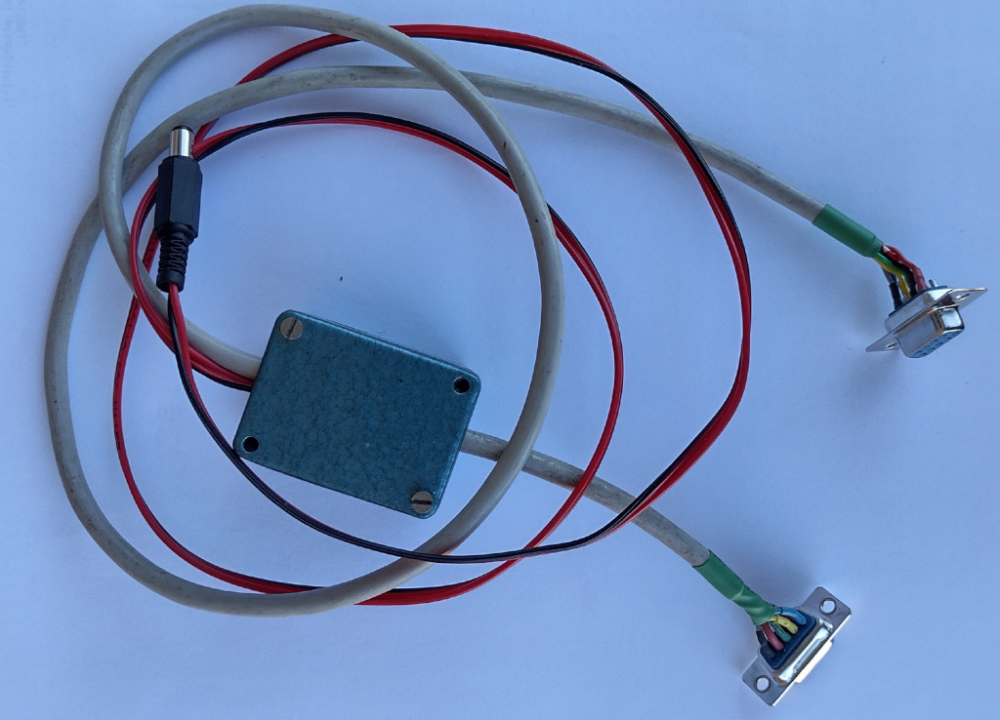
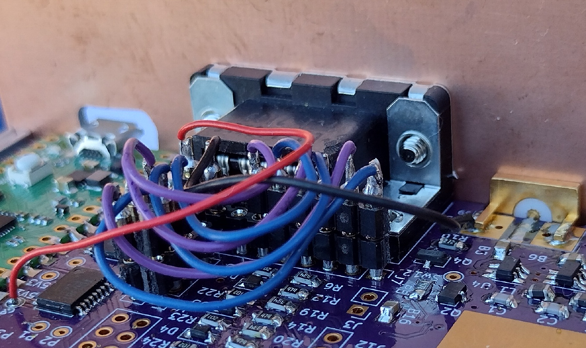

# Arduino code conversion from Pico SDK

This firmware is the modification of the original Pico SDK firmware so that it will compile and install from the Arduino IDE. It is assumed that the user will have the Pico extension to the Arduino environment installed and is familiar with how to compile and upload. If this is not the case, there is plenty of information available on the internet and I recommend that you set it up and become familiar with it before proceeding.

## The General Concept

Apart from the i2c_slave_handler.c there is very little to change in the code. The Arduino IDE adds all the .ino files in the sketchbook directory into a single file and builds that so it is simply a matter of changing the name of the files xxx.c to xxx.ino, commenting out the hl2ioboard.h and i2c_registers.h includes and placing these slightly modified files into the sketchbook folder. Full details follow:

## The firmware example used

This is almostidentical to that used by Jim N2ADR in his n2adr_test example and uses the same libraries. There is a slight difference where Jim only switches 3 filters to show how to do the operation whereas this Arduino example switches five filters.

### The hardware and wiring required

The filter to be switched is a 1 KW capable home brew filter built as an outboard unit with four of its possible six filters installed. Ten metres is covered with an external 10 metre roofing filter in line so the ten metre position is simply a bridge although the future plan is to build the filter into that position. The 160 metre filter is not installed. The relays are activated by grounding the matching pin on the DB_9M plug on the front of the filter. The DB_9M plug connects to the DB_9M plug on the N2ADR IO Board via a DB_9F to DB_9F cable which is broken by inserting a ULN2003 to isolate the Pico IO Board and provide the drive current for the filter switching relays.

The picture below shows the DB9_F to DB9_F lead with the small cast aluminium box containing the ULN2003 and the 12 volt input which is used to power the filter switching relays in the filoter box. At present the I/O lines are connected one to one so each filter switch is driven by one output from J4 on the IO Board but my future plan is to use a 3 of 8 decoder to use 3 IO lines to switch up to 8 filters which will free up enough pins on J7 (the DB9 connector) to allow me to add facilities like RS232 output as well as tuner start and tune complete signals.

### Wiring on the HL2IOBoard

As this board is highly experimantal I did not wish to hard wire the connections as these are expected to be altered several times while I test various scenarios so I elected to solder low profile header sockets into J4 and J7 (the DB9 connector) and joined them with short jumpers cut from the matching pin headers. I am using the 50mm case for my HL2 installation which gives me plenty of room above the HL2 IO Board for clearance of the headers. Shown below is a view of the board showing the header setup.

Using the header pin jumpers:
* jumper from J4 pin 1 to J7 pin 1.
* jumper from J4 pin 2 to J7 pin 2.
* jumper from J4 pin 3 to J7 pin 3.
* jumper from J4 pin 4 to J7 pin 4.
* jumper from J4 pin 5 to J7 pin 5.
* jumper from J4 pin 6 to J7 pin 6.
* Solder a wire from +5V on the Pico board to J7 pin 9. (Not used in this case but done to provide 5 volts to peripherals in future experiments)

## Converting the files:

It is a Quirk of the Arduino IDE that software must be compiled from a folder within the sketchbook directory and that the "maim" code name must be the same as this directory within the sketchbook directory so in this case I have Jim's n2adr_basic/main.c file to my zl2te_arduino directory and renamed it to zl2te_arduino.ino - Note that all .c or .cpp files are renamed to .ino for the Arduino IDE environment.

### Included files:

The CMakeLists.txt files tell the SDK compiler which files to include and also references the library files. The ones used in the n2adr_basic example are ...
* main.c
* hl2ioboard.h
* i2cregisters.h
and from the library:
* configure_pins.c
* led_flasher.c
* i2c_slave_handler.c
* ft817_band_volts.c
* icom_ah4.c
* frequency_code.c
* fcode2bcode.c

In the arduino IDE, rather than having a C Make List file you simply place the files to be used into the sketchbook sub directory that you have created for the project and at compile time they will be picked up by the compiler and compiled as though they were a single file. This means that many #include s will be redundant and are best commented out or deleted and I will go through this file by file as this document proceeds. The final file list in the sketchbook sub directory will be like this ...

* main.c                  becomes	 zl2te_arduino.ino
* hl2ioboard.h            remains	 hl2ioboard.h
* i2cregisters.h          remains	 i2cregisters.h
* configure_pins.c        becomes	 configure_pins.c
* fcode2bcode.c           becomes	 fcode2bcode.c
* frequency_code.c        becomes	 frequency_code.c
* ft817_band_volts.c      becomes	 ft817_band_volts.c
* i2c_slave_handler.c     becomes	 i2c_slave_handler.c
* icom_ah4.c              becomes	 icom_ah4.c
* led_flasher.c           becomes	 led_flasher.c

The picture below shows how this file arrangement will appear in the Arduino IDE

### Changes to the source files
#### 1. zl2te_arduino.ino (was old main.c)
This file has the most extensive changes in function as the Pico SDK I2C functions are completely replaced by the wire library which needs to be included and its callback functions declared but in terms of lines of code it is fairly minimal. It works pretty much the same as the SDK except that the events and their stop procedures are more transparent with the wire library handling all this.
No changes to the functionality of main.c were made in the zl2te_arduino.ino code but some re arranging to accomodate using the wire library and the format that Arduino IDE uses for its layout took place.
For the Arduino IDE the format of the code is like this:

#includes and globals

void setup() {
  // put your setup code here, to run once:

}

void loop() {
  // put your main code here, to run repeatedly:

}

In the global space wire.h was added
#include <Wire.h>
and a debug was created to monitor the traffic on the I2C port to the HL2 which can be commented out on the final compile. All the debug stuff is enclosed in #ifdef's and is in addition to Jim's main.c code.

All the initialisation code was shifted into the "void setup()" space but is mostly unchanged from the original. stdio is not used as the Arduino IDE has built in print functions etc. and the wire library needs to be invoked along with the function callbacks to deal with the i2c traffic.

The running code that is contained in the "while (1) {	// Wait for something to happen" statement is shifted into the "void loop() {" procedure in the Arduino IDE and is unchanged from the original apart from the fact that I have expanded the "switch (band) {  // Set some GPIO pins according to the band" statement to accomodate 6 bands for my purposes rather than the original 3 bands that Jim used in his example.

#### 2.hl2ioboard.h
Changes were quite minimal here and simply consisted of commenting out 3 lines associated with the Pico SDK i2c handling which has been replaced by the Arduino IDE wire library. I have also declared a 30 character buffer to hold my debug messages which probably shouild have been enclosed in an #ifdef DEBUG_I2C

#### 3. i2c_registers.h
No changes occurred in this file

#### 4. configure_pins.ino
The only changes in this file are for the conversion of Pico SDK i2c initialisation where lines 16 & 17 are changed: 
from 
&nbsp;&nbsp;&nbsp;&nbsp; gpio_init(GPIO14_I2C1_SDA);	gpio_set_function(GPIO14_I2C1_SDA, GPIO_FUNC_I2C); 
$~~~~$ gpio_init(GPIO15_I2C1_SCL);	gpio_set_function(GPIO15_I2C1_SCL, GPIO_FUNC_I2C); 
to 
<pre>
$~~~~$ Wire1.setSDA(GPIO14_I2C1_SDA); 
$~~~~$ Wire1.setSCL(GPIO15_I2C1_SCL); 
</pre>
and lines 18 & 19 are commented out 
$~~~~$ // i2c_init(i2c1, I2C1_BAUDRATE); 
$~~~~$ // i2c_slave_init(i2c1, I2C1_ADDRESS, &i2c_slave_handler);
&e4sp; This is a test line
#### 5. fcode2bcode.ino
Simply commenting out the redundant #include "hl2ioboard.h" in line 8 is all that is required here.

#### 6. frequency_code.ino
No changes to this file at all.

#### 7. ft817_band_volts.ino
Commenting out #include "hl2ioboard.h" and #include "i2c_registers.h" in lines 8 & 9 is all that is required on this file.

#### 8. i2c_slave_handler.ino
This file requires the most changes. The main flow of the function is not changed but how it receives the i2c signals requires some code changes.

#### 9. icom_ah4.ino
Commenting out #include "hl2ioboard.h" and #include "i2c_registers.h" in lines 13 & 14 is all that is required on this file.

#### 10. led_flasher.ino
Commenting out #include "hl2ioboard.h" on line 7 is the only change required on this file.

### Install this firmware
* Power off the HL2 and connect a USB cable to the IO Board.
* Push the button on the Pico and then plug the USB cable into your PC.
* The Pico will appear as a flash drive on the PC. Then download the file [build/main.uf2](build/main.uf2) and copy it to the Pico.
* After the file is copied, the Pico will no longer show up as an external drive.
* Disconnect from the PC and power on the HL2.

For more detail, see the instructions in [Installing Firmware section of the main README](../README.md#installing-firmware).

### Amplifier setup

In the amplifier setup menu, set option `4. Transceiver` to `Other` and option `2. ACC Baud Rate` to 19200.

### Wire up a cable

You need a DB-9 male to DB-9 female cable with pins 2, 3 and 5 connected straight through, that is pin 2 to pin 2, pin 3 to pin 3 and pin 5 to pin 5.

## Operating

Once the cable is hooked between the IO Board and the HR-50, changing frequencies in SDR software that supports the IO Board should cause the amplifier to change bands. As you switch band in your software, you should see the amplifier change bands as well. It does _not_ trigger the antenna tuner&mdash;you must do that manually if needed.

If you tune to a frequency outside of a band the amplifier supports, the HR-50 `BAND:` display will indicate `UNK` and the amplifier will not go into transmit. Because the IO Board doesn't receive the exact transmit frquency, this will not happen exactly at the band edge, but when tuned some distance outside of it. It should not happen when tuned inside the band.

As far as I'm aware, the only software that implements the antenna tuning protocol is [Reid's HL2-specific Thetis fork](https://github.com/mi0bot/OpenHPSDR-Thetis/releases), starting in version v2.10.3.4-beta1. To trigger automatic tuning, click the `TUNE` button while pressing the `Ctrl` key. (Be sure the `Setup|General|Ant/Filters|Antenna|Disable on Tune Pwr <35W` box is checked, or transmit may stop before tuning is complete.)

## Questions?

Please post questions, issues, etc. to the [Hermes-Lite group](https://groups.google.com/g/hermes-lite).
